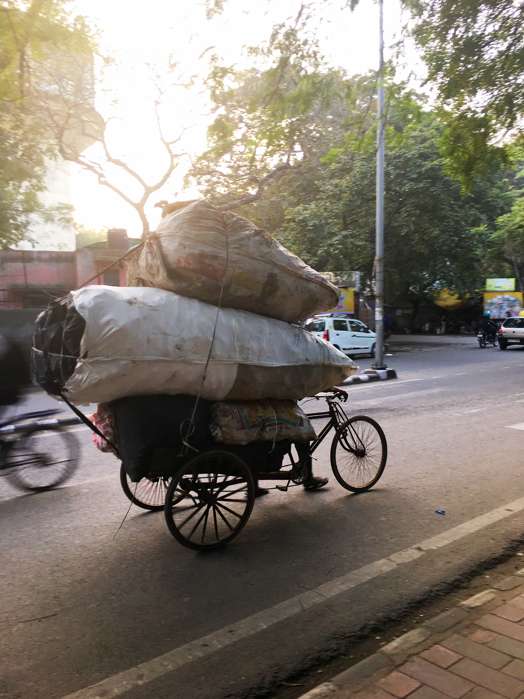
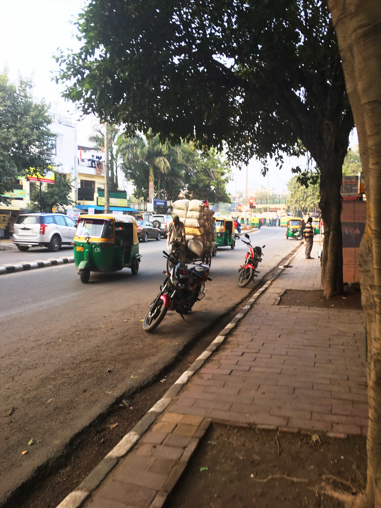

## JANUARY 28TH - FEBRUARY 2ND, 2017

The final stop on this trip was Delhi. We stayed just outside the city proper in the Saket neighborhood, just around the corner from the Saket metro stop. It was super convenient for taking advantage of Delhi’s excellent metro system.

During out time in Delhi, we took a day trip to Agra to see the Taj Mahal, a day trip to see common Delhi sights and spend an afternoon in Old Delhi and the spice market Chandi Chowk. Here are the photo highlights.

